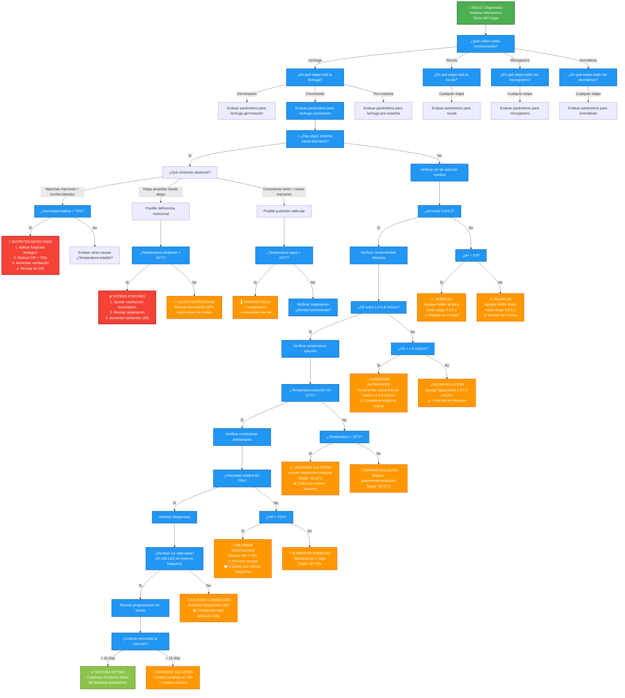

# Sistema Experto para Hidroponía en Tierra del Fuego

## Objetivo
Desarrollar un Sistema Experto rule-based implementado en Python (librería experta) que asista a productores locales en la optimización y mantenimiento de cultivos hidropónicos bajo invernadero en Tierra del Fuego.

## Cultivos Soportados
- **Lechuga** (Lactuca sativa)
- **Rúcula** (Eruca vesicaria)
- **Microgreens** (diversos)
- **Aromáticas** (albahaca, perejil, etc.)

## Árbol de Decisión del Sistema Experto



## Parámetros Críticos Monitoreados

| Parámetro | Rango Óptimo | Acción si fuera de rango |
|-----------|--------------|-------------------------|
| **pH** | 5.8 - 6.2 | Ajuste con buffer alcalino/ácido |
| **CE** | 1.4 - 1.8 mS/cm | Ajuste de concentración de nutrientes |
| **Temp. Solución** | 18 - 22°C | Calefacción/enfriamiento del depósito |
| **Humedad Relativa** | 60 - 75% | Ventilación/nebulización |
| **Fotoperiodo** | 12-16h (invierno) | Ajuste LED para compensar baja radiación |

## Alertas Críticas (Ventana 24-48h)

### Botrytis (Moho Gris)
- **Síntomas**: Manchas marrones + bordes blandos
- **Condición**: HR > 75%
- **Acción**: Fungicida biológico + reducir HR < 70%

### Estrés por Frío Fueguino
- **Condición**: Temperatura ambiente < 10°C
- **Acción**: Ajustar calefacción + revisar aislamiento + aumentar nutrientes 10%

## Tecnologías Utilizadas
- **Python** (Motor de inferencia)
- **Experta** (Sistema de reglas)
- **Mermaid** (Diagramas de flujo)

## Valor Agregado
- ✅ Reducción de pérdidas hasta 50%
- ✅ Optimización de recursos hídricos (< 10% vs agricultura tradicional)
- ✅ Suministro local 12 meses/año
- ✅ Reducción huella de carbono (menos importaciones)

## Contexto Tierra del Fuego
- **Clima extremo**: Invierno < 0°C, vientos fuertes
- **Baja radiación solar**: 3-4 meses cultivo exterior
- **Sistemas**: NFT/DWC predominantes
- **Especies adaptadas**: Resistentes a bajas temperaturas

## Utilización del programa

Para implementar el programa se debe en primer lugar instalar las dependencias en un entorno virtual.

``` bash
python -m venv venv

pip install -r requeriments.txt

```
Ejecutar el backend en la terminal.
``` bash
python app.py
```
Y seguidamente, en otra terminal, el frontend.

``` bash
python interface.py
```
### Despliegue

Una vez ejecutada la aplicación por terminal, se la podrá visitar en la url:

**localhost:7860**

Para los endpoints de la API:

**localhost:8000/docs**

---
*Desarrollado por Facundo Salinas - Sistema Experto para Hidroponía TdF*